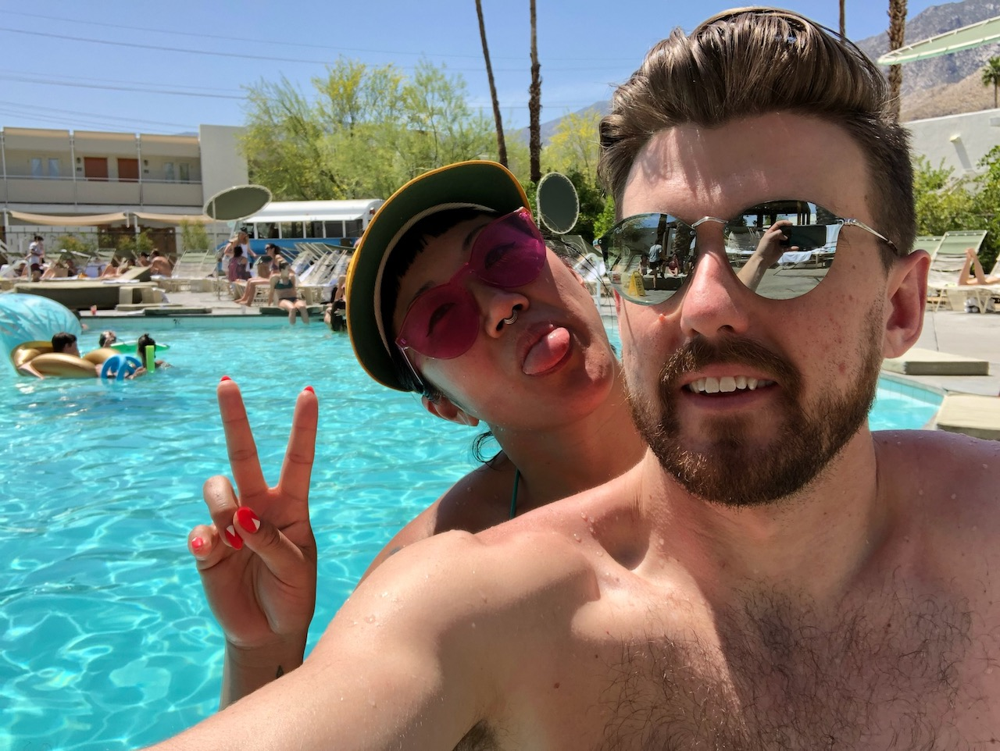
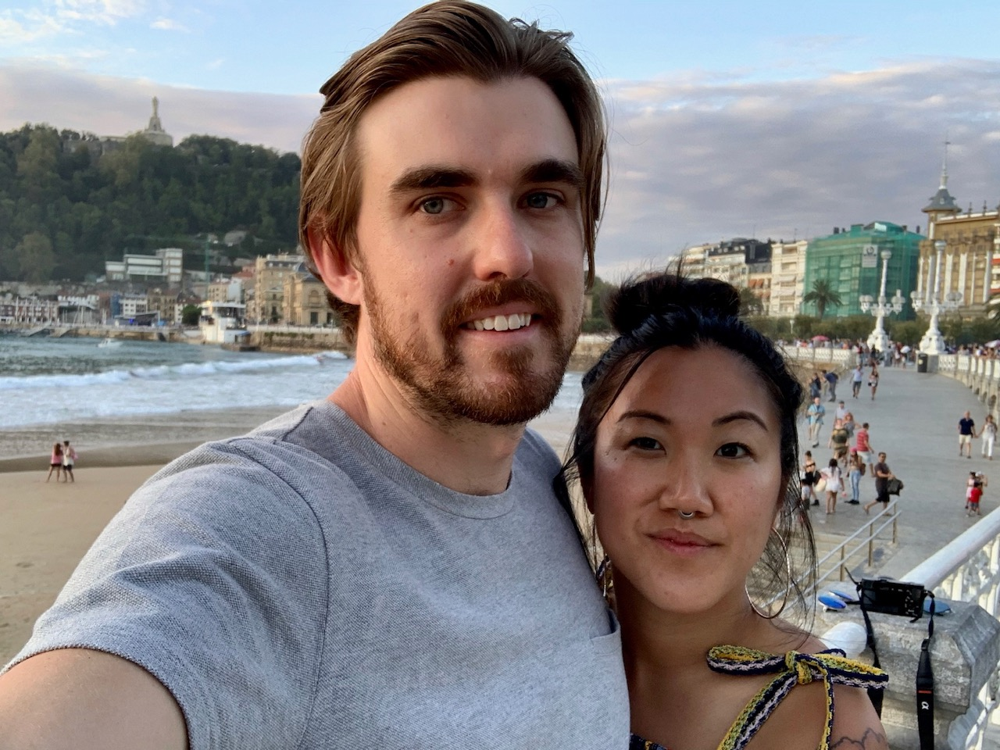
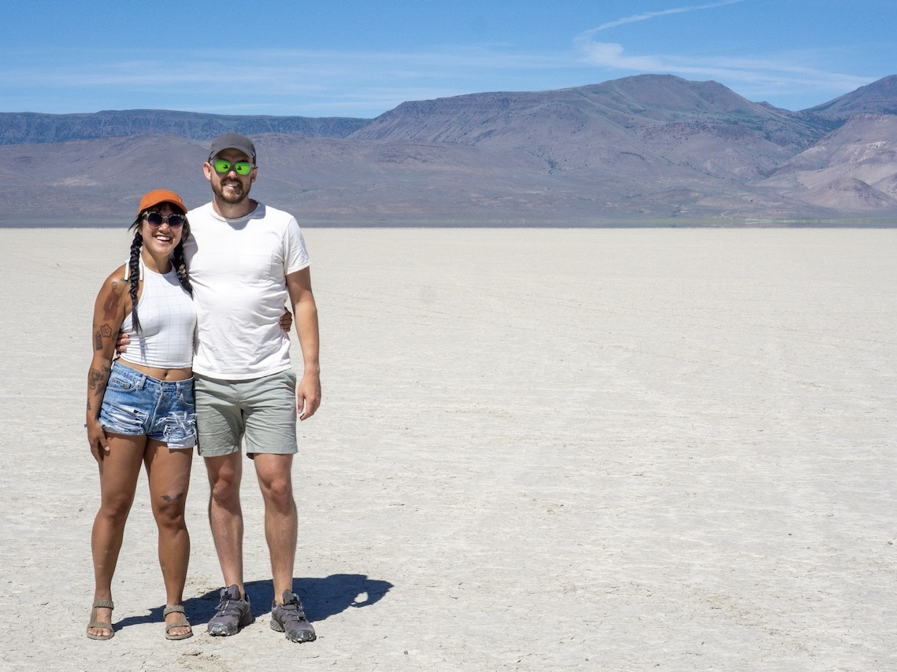
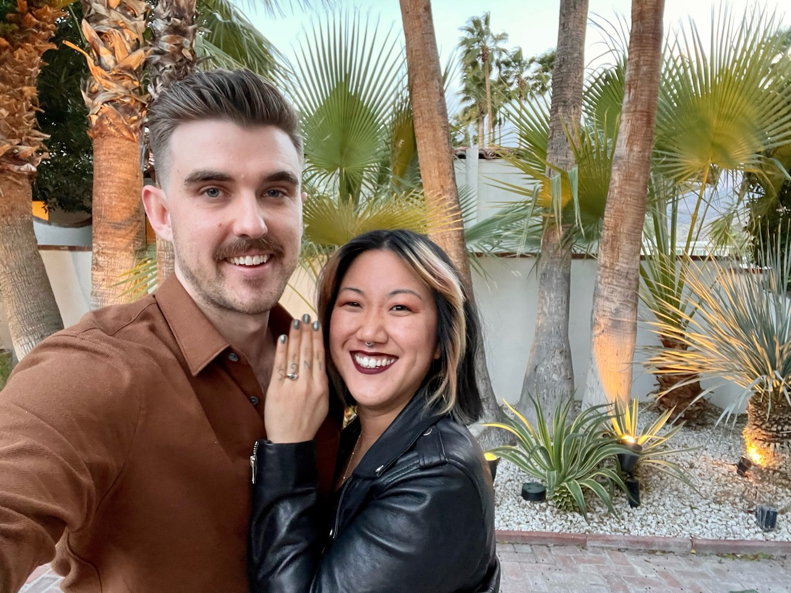

**2018** It all started with a swipe to the right. Or did it start when Jacqi spied Noah across the dance floor a month earlier? Either way, things officially got started in January 2018 over tiki drinks. After a few months of casual dating we decided to take a swing and go to Palm Springs together and that's when it clicked: we had something special.

**2019** We moved in together a year later, and were pleasantly surprised to find our, um, _contrasting_ styles actually worked together quite harmoniously. We balanced nesting with travel—taking trips to Mexico and Spain—and learned that not only could we make great roommates, but we're even better travel buddies.

**2020** And then _this_ year happened. Yeah, being stuck at home sucked, but we learned quickly that how lucky we were to be stuck there together. While remote-life continued as usual for Noah, Jacqi took the year to take the plunge into full-time creative work to great success.

**2021** After making it through a year of the pandemic we were ready to get out of town, so took flight to Palm Springs in March to relive our "dating honeymoon". And that's when Noah popped the question.
